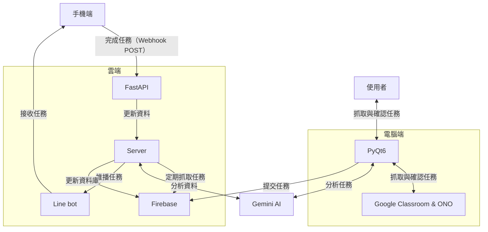

# AI 時間管理工具

> 簡介：以 Python 開發，uv 管理，結合 Gemini API 與 Line Bot 的多客戶端主從式架構時間管理系統。

## 專案介紹
傳統時間管理工具高度仰賴使用者自行蒐集任務與進行安排，本專案旨在解決此痛點，透過自動化的任務抓取功能與 Gemini API 的串接，實現高度個人化的任務安排，並透過 Line Bot 自動通知使用者，以達到全自動的任務安排與管理。

## 核心功能
- **自動化任務抓取**：透過 Google Classroom API 與網頁爬蟲技術，讓使用者可以一鍵抓取所有任務，並自動記錄任務名稱、截止時間等資訊
- **AI 智能規劃**：串接 Gemini API，分析任務相關資訊（認知負荷、預計花費時間等），並根據使用者過去的任務習慣和當日時程，規劃合理、可執行的任務給使用者
- **全自動推播**：結合 Line Bot，於每日晚間 22:00 自動推播隔日任務規劃給使用者，並於當日早晨 07:00 使用 Flex Message 整理任務傳送給使用者，包含任務名稱、截止時間等相關資訊，並可直接透過按鈕完成任務，以達到任務管理的功能
- **雲端部署**：將相關系統部署於 Google Cloud Platform，確保服務 24 小時皆可穩定運行與存取。

## 系統架構

## 技術棧
- **後端技術**：Python 3.11、FastAPI
- **前端介面**：PyQt6
- **套件管理工具**：uv
- **雲端服務**：Google Cloud Platform
- **第三方服務**：Gemini API、Line Bot
- **資料庫**：Firebase